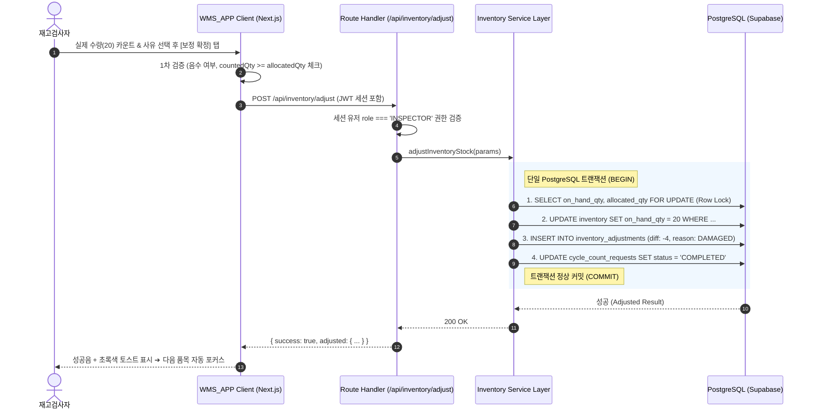

# [UI/UX 설계서] 현장 재고 조사 및 실사 모듈 (Inventory Inspection & Cycle Count)

> **문서 버전**: v1.1  
> **작성일**: 2026-09-08 | **최종 수정**: 2026-09-09  
> **적용 시스템**: WMS_APP (`/inventory/*`)  
> **관련 문서**: [01_PRD.md](01_PRD.md), [02_ADR.md](02_ADR.md) (ADR-001, ADR-002, ADR-006, ADR-007), [03_TRD.md](03_TRD.md) (TRD-001)

---

## 1. 현장 사용자 경험(UX) 핵심 설계 원칙

창고 현장 작업 환경은 일반적인 오피스 웹/앱 환경과 완전히 다릅니다. 재고검사자는 **서서 이동하며, 한 손에는 상품이나 랙을 잡고, 조명이 어둡거나 장갑을 착용한 상태**에서 작업합니다.

```
┌──────────────────────────────────────────────────────────────────┐
│                   현장 최적화 4대 UX 설계 원칙                    │
├──────────────────────────────────────────────────────────────────┤
│ 1. Thumb-Zone 극대화: 화면 하단 40% 영역에 핵심 조작계 집중 배치    │
│ 2. 가상 키보드 점프 방지: 화면 가림을 차단하는 인라인 대형 증감 패드  │
│ 3. One-Tap 일치 확정: 85% 이상의 정상 재고는 터치 1회(0.1초)로 종결│
│ 4. 3중 감각 피드백: 시각(색상) + 청각(비프음) + 촉각(진동 패턴)     │
└──────────────────────────────────────────────────────────────────┘
```

1. **Thumb-Zone (엄지손가락 작업 반경) 극대화**:
   - 모바일 기기를 한 손으로 쥐었을 때 엄지손가락이 자연스럽게 닿는 화면 하단 영역에 주요 액션 버튼(`[스캔]`, `[전산일치 확정]`, `[증감]`, `[저장]`)을 최소 높이 **56px 이상**의 대형 터치 타겟으로 배치합니다.
2. **모바일 가상 키보드 팝업 차단 (No Virtual Keyboard Jump)**:
   - 스마트폰 기본 키보드가 올라오면 화면의 절반을 가려 전산 수량 비교 및 상품 카드 확인이 불가능해집니다. 화면 자체에 `[-10]`, `[-1]`, `[+1]`, `[+10]` **인라인 대형 증감 패드**를 탑재하여 키보드 호출을 원천 배제합니다.
3. **원터치 전산 일치 (One-Tap Match)**:
   - 실무 현장의 대다수 품목은 전산 수량과 일치합니다. 숫자를 일일이 세서 입력하지 않고, 박스 수량이 맞으면 녹색 `[전산 수량(N)과 일치 (One-Tap)]` 버튼 한 번으로 검수를 즉시 완료합니다.
4. **시각 + 청각 + 촉각 3중 감각 피드백**:
   - 화면을 계속 주시하지 않아도 스캔 및 카운트 결과를 인지할 수 있도록 즉각적인 오디오와 햅틱을 제공합니다.

---

## 1-1. 메뉴 구조 및 라우트 명세 (Menu Architecture)

재고검사자의 화면은 복잡한 다단계 메뉴 대신, 한 손 조작이 가능한 **하단 4대 탭바(Bottom Navigation Tab)** 중심의 직관적 구조를 따릅니다.

```
┌────────────────────────────────────────────────────────────────────────┐
│              [INSPECTOR] 창고 현장 재고관리 4대 탭 메뉴 구조           │
├────────────────────────────────────────────────────────────────────────┤
│ 🏠 [홈]      : 오늘 실사 현황 요약, 긴급 결품 실사 큐 배너 알림       │
│ 🔍 [퀵 조회] : 랙 로케이션 바코드 또는 상품 UPC 즉시 조회            │
│ 📋 [실사 큐]  : 피킹 결품(CMD-SKIP) 발생 품목 목록 및 정기 실사 목록  │
│ 🔄 [이동]    : 4단계 Bin-to-Bin 이동 마법사                          │
└────────────────────────────────────────────────────────────────────────┘
```

### 라우트 트리 (Route Tree)

```text
src/app/(inventory)/
├── layout.tsx          # 하단 4대 탭바 + 상단 스캐너 상태 헤더 공통 레이아웃
├── page.tsx            # [탭 1: 홈] 오늘 실사 요약 & 긴급 실사 큐 배너
├── lookup/
│   └── page.tsx        # [탭 2: 퀵 조회] 로케이션별 적치 품목 / SKU 위치 역추적
├── queue/
│   └── page.tsx        # [탭 3: 실사 큐] 피킹 결품 & 정기 실사 대기 목록
├── transfer/
│   └── page.tsx        # [탭 4: 이동] 4단계 Bin-to-Bin 이동 마법사
└── count/
    └── page.tsx        # [실사 상세] 품목별 전산↔실물 대조 및 오차 보정 (탭바 없는 집중 모드)
```

### 바코드 스캔 인터셉터 동작 방식 (Global Barcode Interceptor)

`(inventory)/layout.tsx`에 전역 `keydown` 이벤트 리스너를 등록하여, 사용자가 어느 탭 화면에 있든 스캐너 입력이 감지되면 **접두사(Prefix)를 자동 분석하여 적절한 화면으로 즉시 라우팅**합니다.

```
[바코드 스캔 입력]
        │
        ▼
[Prefix 자동 판별]
        ├──> "LOC-" 로 시작 ──> 해당 로케이션의 적치 상품 목록 표시 (퀵 조회)
        ├──> 12~13자리 숫자 (UPC/EAN) ──> 해당 상품이 있는 모든 로케이션 역추적
        ├──> "SKU-" 로 시작 ──> SKU 기준 로케이션 역추적
        └──> 미등록 / 불일치 ──> 빨간 경고 토스트 + 2회 진동
```

> [!NOTE]
> 블루투스 링스캐너(HID 키보드 웨지 모드)와 카메라 스캐너를 동시 지원합니다. 포커스가 특정 입력창에 없어도 어느 화면에서나 스캔이 즉시 인식됩니다.

---

## 2. 화면별 UI 와이어프레임 및 레이아웃

### 2.1 [화면 A] 현장 재고 메인 & 바코드 퀵 조회 (`/inventory`)

로케이션 바코드 또는 상품 UPC를 스캔하여 즉시 적치 현황을 확인하고, 피킹 결품(`CMD-SKIP`)으로 인입된 긴급 실사 큐를 모니터링하는 진입 화면입니다.

```text
┌──────────────────────────────────────────────┐
│ [≡] 재고 검사 (INSPECTOR)     [🟢 HID 연결됨] │  ← 상단 바코드 스캐너 상태
├──────────────────────────────────────────────┤
│ 🚨 긴급 실사 대기: 3건 (피킹 결품 요청)      [보기]│  ← 피킹 연동 실사 알림 배너
├──────────────────────────────────────────────┤
│ ┌──────────────────────────────────────────┐ │
│ │ 📷 [바코드 스캔 또는 직접 입력]          │ │  ← 카메라/블루투스 스캐너
│ │   "로케이션 바코드(A-01-05-2) 또는       │ │
│ │    상품 바코드(UPC)를 스캔하세요"        │ │
│ └──────────────────────────────────────────┘ │
│                                              │
│ [최근 스캔 로케이션: A-01-05-2] (상온 Zone A)│
│                                              │
│ ┌──────────────────────────────────────────┐ │
│ │ 📦 신선 사과 1kg (SKU-APPLE-01)          │ │  ← 로케이션 내 적치 상품 카드
│ │    UPC: 8801234567890                    │ │
│ │    전산 실재고: 24 BOX (피킹할당: 4 BOX) │ │
│ │    가용 재고: 20 BOX                     │ │
│ │                                          │ │
│ │  ┌─────────────────┐  ┌────────────────┐ │ │
│ │  │ [재고 실사 시작]│  │ [로케이션 이동]│ │ │
│ │  └─────────────────┘  └────────────────┘ │ │
│ └──────────────────────────────────────────┘ │
│                                              │
│ ┌──────────────────────────────────────────┐ │
│ │ 📦 유기농 바나나 (SKU-BANANA-02)         │ │
│ │    전산 실재고: 10 BOX (피킹할당: 0 BOX) │ │
│ │    가용 재고: 10 BOX                     │ │
│ │  ┌─────────────────┐  ┌────────────────┐ │ │
│ │  │ [재고 실사 시작]│  │ [로케이션 이동]│ │ │
│ │  └─────────────────┘  └────────────────┘ │ │
│ └──────────────────────────────────────────┘ │
│                                              │
│ ┌──────────────────────────────────────────┐ │  ← Thumb-Zone 고정 탭바
│ │  [🏠 홈]     [🔍 퀵조회]   [📋 실사큐]   [🔄 이동]│
│ └──────────────────────────────────────────┘ │
└──────────────────────────────────────────────┘
```

---

### 2.2 [화면 B] 재고 실사(Cycle Count) 검수 및 오차 보정 (`/inventory/count`)

선택된 로케이션 및 품목의 전산 수량과 실물 수량을 대조하고, 오차 발생 시 사유 코드를 입력하여 단일 트랜잭션으로 보정하는 핵심 작업 화면입니다.

```text
┌──────────────────────────────────────────────┐
│ [← 뒤로] 로케이션: A-01-05-2                 │
├──────────────────────────────────────────────┤
│ 📦 신선 사과 1kg                             │
│ SKU: SKU-APPLE-01 | UPC: 8801234567890       │
│                                              │
│ ┌────────────────────┐  ┌──────────────────┐ │
│ │    [전산 재고]     │  │   [실제 카운트]  │ │  ← 대비형 대형 숫자 카드
│ │      24 BOX        │  │     20 BOX       │ │
│ └────────────────────┘  └──────────────────┘ │
│                                              │
│         🚨 차이: -4 BOX (전산 대비 부족)     │  ← 오차 실시간 자동 연산
├──────────────────────────────────────────────┤
│ [인라인 퀵 증감 패드 (Thumb-Zone)]           │
│ ┌──────────┐ ┌─────────┐ │ ┌─────────┐ ┌─────────┐
│ │   -10    │ │   -1    │ │ │   +1    │ │   +10   │  ← 60px 높이 대형 버튼
│ └──────────┘ └─────────┘ │ └─────────┘ └─────────┘
│                                              │
│ [사유 코드 선택 (차이 발생 시 필수)]         │
│ ┌──────────────────────────────────────────┐ │
│ │ ▼ 사유: 박스 파손 (DAMAGED)              │ │  ← 사유 미선택 시 확정 차단
│ └──────────────────────────────────────────┘ │
│                                              │
│ ┌──────────────────────────────────────────┐ │
│ │ 메모: 상차 작업 중 4박스 낙하 파손 확인   │ │
│ └──────────────────────────────────────────┘ │
│                                              │
│ ┌──────────────────────────────────────────┐ │  ← 일치 시 원터치 완료
│ │ 🟢 전산 수량(24)과 일치 (One-Tap 확정)   │ │
│ ├──────────────────────────────────────────┤ │  ← 차이 발생 시 활성화
│ │ ⚠️ 실사 수량(20)으로 보정 확정 (트랜잭션) │ │
│ └──────────────────────────────────────────┘ │
└──────────────────────────────────────────────┘
```

#### 오차 사유 코드 전체 목록 (Reason Code Specification)

오차가 발생한 경우, 사유 코드 선택이 **필수**입니다. 미선택 시 [보정 확정] 버튼이 비활성화됩니다.

| 사유 코드 | 한국어 표시명 | 설명 및 사용 예시 |
|:---|:---|:---|
| `COUNT_MISMATCH` | **수량 오차** | 세어보니 전산과 다름 (원인 불명확한 일반 오차) |
| `DAMAGED` | **상품 파손** | 박스 낙하, 충격, 찌그러짐 등으로 사용 불가 처리 |
| `LOST` | **분실** | 물리적으로 재고가 사라졌으나 원인 미파악 |
| `FOUND` | **재고 발견** | 전산에 없던 재고가 실물로 발견됨 (플러스 보정) |
| `EXPIRED` | **유통기한 경과** | 유통기한이 지난 상품을 폐기 처리 |

---

### 2.3 [화면 C] 로케이션 간 재고 이동 마법사 (`/inventory/transfer`)

출발지 로케이션의 재고를 목적지 로케이션으로 이동시킬 때 실수 없이 단계별로 가이드하는 4단계 스텝 위저드입니다.

```text
┌──────────────────────────────────────────────┐
│ [← 뒤로] 재고 이동 (Bin-to-Bin Transfer)     │
├──────────────────────────────────────────────┤
│ [Step 1: 출발 로케이션] ➔ [A-01-05-2] (완료) │
│ [Step 2: 대상 상품]     ➔ [신선 사과 1kg]    │
│ [Step 3: 이동 수량]     ➔ [ 5 BOX ]          │
│                                              │
│ [Step 4: 목적지 로케이션 스캔 대기중...]     │
│ ┌──────────────────────────────────────────┐ │
│ │ 📷 목적지 랙 바코드를 스캔하세요          │ │
│ │    (예: A-01-08-1)                       │ │
│ └──────────────────────────────────────────┘ │
│                                              │
│ ┌──────────────────────────────────────────┐ │
│ │ 🚀 이동 실행 및 전산 반영 (5 BOX)        │ │  ← 목적지 스캔 완료 시 활성화
│ └──────────────────────────────────────────┘ │
└──────────────────────────────────────────────┘
```

---

## 3. 시각 / 청각 / 촉각 피드백 명세표

| 상황 (Event) | 시각 UI 피드백 | 청각 피드백 (Audio) | 촉각 피드백 (Haptic) |
|---|---|---|---|
| **바코드 스캔 성공** | 0.2초간 카드 테두리 에메랄드 그린 점멸 | 짧고 경쾌한 고음 비프 (`1200Hz, 80ms`) | 1회 가벼운 진동 (`50ms`) |
| **바코드 불일치 / 미등록** | 로즈 레드 테두리 + 경고 토스트 | 저음 2단 버저 (`400Hz ➔ 300Hz, 200ms`) | 2회 연속 진동 (`100ms - 50ms - 100ms`)|
| **전산 수량 일치 확정** | 에메랄드 배경 전환 + 체크 애니메이션 | 완료 차임벨 (`C5 - E5 - G5, 150ms`) | 1회 묵직한 진동 (`120ms`) |
| **재고 오차 보정 완료** | 앰버 오렌지 배경 + 오차 요약 뱃지 | 확인 톤 (`880Hz, 120ms`) | 1회 보통 진동 (`80ms`) |
| **오류 (음수/할당 미만)**| 붉은색 경고 모달 + 입력창 진동 흔들림 | 오류 경고음 (`300Hz, 300ms`) | 3회 강력한 진동 (`150ms x 3`) |

---

## 4. 프론트엔드 - 백엔드 트랜잭션 안전성 보장 흐름



---

## 4-1. 역할 기반 접근 제어 (Role-Based Access Control)

`src/middleware.ts`에서 로그인 세션의 `role` 필드를 검사하여, 역할 외 경로 접근을 강제 차단합니다.

| 사용자 역할 | 자동 진입 경로 | 접근 차단 경로 | 차단 시 동작 |
|:---|:---|:---|:---|
| `PICKER` | `/picking/run` | `/inventory/*` 전체 | `/picking/run`으로 강제 리다이렉트 |
| `INSPECTOR` | `/inventory` | `/picking/*` 전체 | `/inventory`로 강제 리다이렉트 |
| `ADMIN` | `/admin/dashboard` | 없음 (전체 접근 가능) | — |

**백엔드 서비스 레이어 이중 검증**:
- `POST /api/inventory/adjust` (재고 보정): `INSPECTOR` 또는 `ADMIN` 토큰만 처리. `PICKER` 토큰으로 호출 시 `403 Forbidden` 반환.
- `POST /api/picking/complete` (피킹 완료): `PICKER` 또는 `ADMIN` 토큰만 처리.

> [!CAUTION]
> 미들웨어 보호만으로는 충분하지 않습니다. 클라이언트가 URL을 직접 조작하더라도 백엔드 서비스 레이어에서 **토큰의 role을 반드시 재검증**해야 합니다.

---

## 5. 컴포넌트 구조 및 디렉토리 매핑

```text
src/
├── app/
│   └── (inventory)/                           # 재고검사자 전용 라우트 그룹
│       ├── layout.tsx                         # 탭바 네비게이션 & 스캐너 상태 헤더
│       ├── page.tsx                           # [탭 1: 홈] 현장 재고 메인 & 실사 대기 배너
│       ├── lookup/page.tsx                    # [탭 2: 퀵 조회] 바코드 퀵 조회 뷰어
│       ├── queue/page.tsx                     # [탭 3: 실사 큐] 피킹 결품 & 정기 실사 목록
│       ├── count/page.tsx                     # [실사 상세] 재고 실사 검수 및 오차 보정 화면
│       └── transfer/page.tsx                  # [탭 4: 이동] 로케이션 이동 마법사
│
├── components/
│   ├── features/inventory/
│   │   ├── scanner-status-badge.tsx           # 블루투스 링스캐너 연결 상태 뱃지
│   │   ├── location-item-card.tsx             # 로케이션 적치 품목 카드
│   │   ├── inline-number-pad.tsx              # 인라인 대형 증감 패드 (Thumb-Zone)
│   │   ├── cycle-count-modal.tsx              # 실사 사유 입력 및 확정 다이얼로그
│   │   ├── discrepancy-badge.tsx              # 오차 수량 강조 뱃지 (+2, -4)
│   │   ├── urgent-queue-banner.tsx            # 긴급 실사 대기 건 알림 배너 (CMD-SKIP 연동)
│   │   └── reason-code-selector.tsx           # 사유 코드 선택 드롭다운 (5종 코드)
│   │
│   └── ui/                                    # 원자 단위 UI 컴포넌트
│       ├── button.tsx                         # 56px 대형 터치 버튼
│       ├── badge.tsx                          # 상태 뱃지
│       └── toast.tsx                          # 햅틱 연동 알림 토스트
│
├── lib/
│   ├── audio.ts                               # Web Audio API 기반 비프/버저 사운드 엔진
│   └── haptic.ts                              # Navigator.vibrate 기반 햅틱 패턴 엔진
│
└── services/
    └── inventory.service.ts                   # 재고 조회/보정/이동 원자적 트랜잭션
```

---

## 6. 창고 현장 운영 엣지 케이스 및 고려사항

### 6.1 피킹 진행 중인 재고 보호 (`allocated_qty` Guard)

피킹 작업자가 이미 주문에 할당하여 피킹 중인 수량(`allocated_qty`) 이하로 실재고(`on_hand_qty`)를 강제 차감하면 해당 주문의 피킹이 완료 불가능한 상태가 됩니다.

- **클라이언트 1차 검증**: 보정 확정 버튼 탭 시점에 `counted_qty >= allocated_qty`를 체크하여 위반 시 즉시 붉은 경고 모달 표시.
- **백엔드 2차 검증**: 서비스 레이어에서 `SELECT ... FOR UPDATE`로 최신 `allocated_qty`를 조회한 뒤 동일 조건 재확인 후 위반 시 `409 Conflict` 반환.

### 6.2 네트워크 불안정 (Wi-Fi 음영 지역) 대응

창고 랙 사이 통로는 Wi-Fi 음영 구간이 발생할 수 있습니다.

- 트랜잭션 실패 시 **"서버 연결이 끊어졌습니다. 다시 시도하시겠습니까?"** 재시도 팝업 표시.
- 현재 카운트 중인 실사 수량과 사유 코드를 `localStorage`에 임시 저장하여, 재연결 후 데이터 유실 없이 재전송 가능하도록 처리.
- 상단 헤더에 실시간 연결 상태 인디케이터(`🟢 온라인` / `🔴 오프라인`) 표시.

### 6.3 조명 및 디스플레이 가독성

어두운 냉동창고 통로와 밝은 형광등 환경 모두에서 선명하게 읽힐 수 있도록:

- **폰트**: 핵심 수량 및 로케이션 코드는 **28px~32px 볼드** 적용.
- **컬러**: 순수 흰색(`#ffffff`) 텍스트 + 고채도 시맨틱 컬러(에메랄드 `#22c55e`, 앰버 `#f59e0b`, 로즈 `#ef4444`).
- **테마**: 배터리 소모 절감 및 현장 눈부심 방지를 위한 **다크 기반 고대비 테마** 적용 (`bg-page: #0a0a0a`).
- 과도한 블러(`backdrop-filter: blur`), 그라데이션 텍스트, 3D 효과 등 시인성을 해치는 요소 일체 배제.

---

## 7. 구현 순서 로드맵 (Implementation Roadmap)

```
[Phase 1: DB & 백엔드]  →  [Phase 2: 서비스 레이어 & API]  →  [Phase 3: 컴포넌트]  →  [Phase 4: 화면 조립]
```

| 단계 | 작업 항목 | 산출물 |
|:---:|:---|:---|
| **Phase 1** | DB 스키마 마이그레이션 | `inventory_adjustments` 테이블, `cycle_count_requests` 테이블 |
| **Phase 2** | 백엔드 서비스 & API 구현 | `inventory.service.ts` (퀵조회/수량보정/이동), `/api/inventory/*` 라우트 핸들러 |
| **Phase 3** | 현장 UX 컴포넌트 개발 | `inline-number-pad.tsx`, `urgent-queue-banner.tsx`, `reason-code-selector.tsx`, `audio.ts`, `haptic.ts` |
| **Phase 4** | 화면 조립 및 통합 테스트 | `/inventory` 메인, `/inventory/count` 실사 화면, `/inventory/queue` 실사 큐, `/inventory/transfer` 이동 마법사 |
