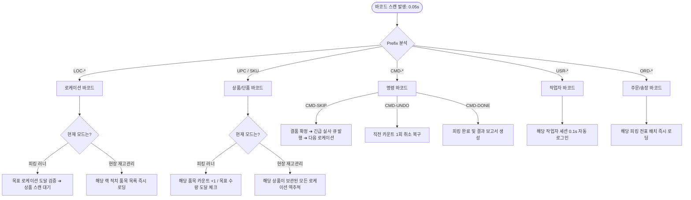

# [바코드 시스템 설계서] Glife WMS Barcode System Architecture & Specification

> **문서 버전**: v1.0  
> **작성일**: 2026-09-09  
> **적용 시스템**: Glife mobile-app (No-Click 고속 피킹 및 현장 재고관리 모듈)  
> **관련 문서**: 
> - [01_PRD.md](01_PRD.md)
> - [02_ADR.md](02_ADR.md) (ADR-003, ADR-005)
> - [03_TRD.md](03_TRD.md)
> - [현장_재고_조사_UI_UX_설계.md](현장_재고_조사_UI_UX_설계.md)

---

## 1. 개요 및 설계 목표

Glife WMS의 핵심 설계 원칙은 **"터치 없는 고속 작업(No-Click, 0.05초 반응 속도)"**과 **"작업자 실수 및 데이터 오염 원천 차단"**입니다.
본 바코드 시스템은 창고 내 모든 개체(로케이션, 품목, 박스, 주문, 작업자)와 공정 제어 명령(Command)을 표준화된 바코드 규격으로 정의하여, 모바일 PWA 환경에서 블루투스 웨어러블 링 스캐너(Ring Scanner) 및 카메라로 100% 원활하게 작동하도록 설계되었습니다.

```
┌────────────────────────────────────────────────────────────────────────┐
│                      Glife WMS 바코드 시스템 4대 목표                    │
├────────────────────────────────────────────────────────────────────────┤
│ 1. Zero-Touch (No-Click): 화면 터치 조작 없이 바코드만으로 작업 완결    │
│ 2. Self-Routing: 접두사(Prefix) 기반 시스템 자동 판별 및 라우팅         │
│ 3. 0.05s Instant Feedback: 스캔 즉시 시각/청각/촉각 3중 감각 피드백      │
│ 4. Plug & Play: 별도 앱 설치 없는 웹 표준 Bluetooth HID 키보드 웨지    │
└────────────────────────────────────────────────────────────────────────┘
```

---

## 2. 바코드 심볼로지(Symbology) 및 데이터 규격 (Data Schema)

작업자가 어떤 화면에 있든, 스캐너가 읽은 데이터의 **접두사(Prefix)**를 통해 시스템이 해당 바코드의 유형과 목적을 스스로 판별합니다.

### 2.1 바코드 데이터 표준 명세표

| 구분 | 접두사(Prefix) / 체계 | 권장 규격 (Symbology) | 데이터 예시 | 상세 설명 및 부착 위치 |
|:---|:---|:---|:---|:---|
| **로케이션 (Location)** | `LOC-[Zone][Aisle][Bay][Level:알파벳][Bin]` | **Code 128** | `LOC-A0105B01` | 창고 선반 랙 전면 부착.<br>Zone(1)+Aisle(2)+Bay(2)+Level(영문1)+Bin(2).<br>• 인간 표기: **`A01-05-B01`** |
| **상품 단품 (Item / SKU)** | 12~13자리 숫자 또는 `SKU-*` | **UPC-A / EAN-13 / Code 128** | `8801234567890`<br>`SKU-APPLE-01` | 제조사 바코드(UPC/EAN) 원본 활용.<br>피킹 시 수량 자동 카운트, 재고 위치 역추적. |
| **박스/입고 (Box / Case)** | 14자리 숫자 | **ITF-14** (Interleaved 2 of 5) | `18801234567897` | 골판지 박스 표면 인쇄용 규격.<br>입고 적치 및 박스 단위 재고 이동 시 묶음(Box) 처리. |
| **명령 바코드 (Command)** | `CMD-[ACTION]` | **Code 128** | `CMD-SKIP`<br>`CMD-UNDO`<br>`CMD-DONE` | **현장 제어용 3대 명령 바코드**.<br>작업자 카트/명찰에 부착하여 화면 터치 없이 제어. |
| **작업자 (User / Badge)** | `USR-[사번/ID]` | **Code 128** | `USR-1042` | 작업자 사원증/배지에 부착.<br>스캔 즉시 PIN/비밀번호 없이 0.1초 만에 자동 로그인. |
| **주문/전표 (Order / Pick)** | `ORD-[송장번호/일자-순번]` | **Code 128** | `ORD-20260908-01` | 종이 픽티켓 또는 출하 전표 상단 인쇄.<br>스캔 시 해당 주문의 피킹 러너 즉시 구동. |

### 2.2 로케이션 5단계 좌표 체계 및 인간 인지 최적화 표준 가이드

창고 랙 및 보관 구역의 물리적 좌표를 표준 5단계 계층으로 정의하되, 현장 작업자의 시각적 혼동(숫자 연속 `01010101`로 인한 전치 오류)을 원천 차단하기 위해 **영숫자 교차(Alphanumeric Alternation) 및 3단 인지 청킹(Chunking)**을 공식 표준으로 적용합니다.

```
[로케이션 좌표 계층 구조]
 Zone (구역) ➔ Aisle (통로) ➔ Bay (베이/열) ➔ Level (단/층: 영문) ➔ Bin (칸)
```

| 좌표 요소 | 코드 길이 | 형식 | 예시 | 물리적 의미 및 현장 설명 |
|:---|:---:|:---:|:---:|:---|
| **1. Zone (구역)** | 1자 | 영문 대문자 | `A`, `F`, `R` | 보관 특성/온도 구역 (`A`: 상온 Ambient, `F`: 냉동 Freeze, `R`: 대량보관 Reserve) |
| **2. Aisle (통로)** | 2자 | 2자리 숫자 | `01`, `02` | 창고 통로 번호. 피킹 경로 생성 시 최적 동선(S-Shape) 정렬의 1차 기준. |
| **3. Bay (베이/열)** | 2자 | 2자리 숫자 | `01`, `05`, `12` | 통로 내 기둥과 기둥 사이의 랙 1칸(수평 위치, 열 번호). 동선 정렬의 2차 기준. |
| **4. Level (단/층)** | **1자** | **영문 대문자** | **`A`, `B`, `C`, `D`** | **[인간 인지 표준] 랙의 수직 선반 단(바닥부터 최하단 `A단(1단)`, `B단(2단)`, `C단(3단)`, `D단(4단)`)** |
| **5. Bin (빈/칸)** | 2자 | 2자리 숫자 | `01`, `02`, `03` | 단(Level) 내에서 바구니/칸막이로 가로 분할된 세부 위치.<br>• 단 전체를 단일 위치로 사용 시 기본값 `01` 지정. |

#### 인간 인지 최적화 2대 표준 규칙

1. **원칙 ①: 영숫자 교차 (Alphanumeric Alternation)**
   - 연속된 숫자열(`A-01-05-02-01` 또는 `A01010101`)은 숫자가 겹쳐 작업자의 눈 피로도와 읽기 실수를 유발합니다.
   - 선반 단(Level)을 숫자가 아닌 **영문 알파벳(`A`, `B`, `C`, `D`...)**으로 치환하여 숫자와 문자를 교차 배치함으로써 시각적 착시를 100% 방지합니다.
2. **원칙 ②: 3단 인지 청킹 (Cognitive 3-Chunk Grouping)**
   - 인간의 단기 기억 용량(밀러의 법칙: 3~4 청크)에 맞춰 작업자의 동선 이동 순서대로 3개 덩어리로 묶습니다:
     - `[1단계: 어느 통로로 가는가?]` ➔ **`A01`** (Zone + Aisle)
     - `[2단계: 몇 번째 랙 기둥인가?]` ➔ **`05`** (Bay)
     - `[3단계: 선반의 어느 단/칸인가?]` ➔ **`B01`** (Level: B단 + Bin: 01번칸)

#### 공식 데이터 표현 규격 (Data Format Specification)

* **인간 판독용 공식 표기 (Human-Readable Text)**:  
  ➔ **`A01 - 05 - B01`** (A구역 01번 통로 / 05번 베이 / B단 01번칸)
* **바코드 스캔 데이터 (Machine-Readable String)**:  
  ➔ **`LOC-A0105B01`** (Code 128, 총 12자리 컴팩트 포맷으로 스캔 성공률 극대화)
* **현장 구두 소통 호칭 (Verbal Communication)**:  
  ➔ *"A 1통로, 5열, **B단 1번**"*
* **하위 호환성 및 유연한 파싱 (Backward Compatibility)**:  
  시스템 파서는 신규 표준(`LOC-A0105B01`, `A01-05-B01`)은 물론, 과거 숫자 기반 좌표(`LOC-A01050201`, `A-01-05-02-01`)가 인입되어도 자동으로 `Level 02 ➔ B`로 상호 매핑하여 완벽히 호환 처리합니다.

---

## 3. 현장 제어용 3대 명령 바코드 (Command Barcodes)

피킹 작업 중 장갑을 착용한 손으로 스마트폰 화면을 터치하는 비효율을 방지하기 위해 **명령 바코드**를 제공합니다. 작업자는 카트 손잡이나 손목 밴드에 부착된 바코드를 스캔하여 조작합니다.

```
┌──────────────┐     ┌──────────────┐     ┌──────────────┐
│   CMD-SKIP   │     │   CMD-UNDO   │     │   CMD-DONE   │
│ |||||||||||| │     │ |||||||||||| │     │ |||||||||||| │
│  [결품 패스]  │     │  [직전 취소]  │     │  [피킹 완료]  │
└──────────────┘     └──────────────┘     └──────────────┘
```

1. **`CMD-SKIP` (결품 / 위치 건너뛰기)**:
   - **동작**: 현재 로케이션에 실물 재고가 없거나 찾을 수 없을 때 스캔.
   - **효과**:
     - 피킹 화면은 지체 없이 다음 최적 동선 로케이션으로 자동 전환.
     - 백엔드 `cycle_count_requests` 테이블에 `URGENT` 우선순위의 **긴급 실사 요청 자동 발행**.
     - 재고관리자(`INSPECTOR`) 화면에 즉각 결품 알림 배너 표시.
2. **`CMD-UNDO` (직전 스캔 취소)**:
   - **동작**: 실수로 다른 상품을 찍었거나, 수량을 초과 스캔했을 때 스캔.
   - **효과**: 직전 1회의 스캔 카운트를 원복(-1)하고 정상 상태로 복구.
3. **`CMD-DONE` (작업 강제 종료 및 전송)**:
   - **동작**: 배치 피킹 완료 시점 또는 관리자 승인 하에 잔여 품목을 스킵하고 조기 마감할 때 스캔.
   - **효과**: 현재까지의 피킹 실적을 확정 저장하고 결과 요약 화면으로 이동.

---

## 4. 하드웨어 구성 및 통신 아키텍처 (Bluetooth HID Wedge)

별도의 OS 네이티브 SDK나 복잡한 시리얼(SPP) 드라이버 설치 없이, **순수 웹 기술(PWA)**로 장치 독립성을 확보합니다.

```
┌────────────────────────────────┐
│  웨어러블 핑거 링 스캐너          │
│  (양손 자유 / 360도 회전 헤드)    │
└───────────────┬────────────────┘
                │ Bluetooth HID (Keyboard Wedge)
                ▼
┌────────────────────────────────┐
│  스마트폰 / 태블릿 (PWA 웹앱)     │
│  - 전역 Keydown 버퍼 리스너     │
│  - 50ms 스트림 파서            │
│  - Web Audio / Haptic 사운드   │
└────────────────────────────────┘
```

### 4.1 권장 하드웨어 구성
* **피킹 작업자 (`PICKER`)**:
  * **스캐너**: 블루투스 핑거 링 스캐너 (Ring Scanner, 예: Eyoyo, Zebra RS5100 등)
  * **단말기**: 손목 스트랩 장착 스마트폰 또는 피킹 카트 거치대
  * **장점**: 양손으로 상자와 과일을 들면서 검지 손가락 측면의 버튼 하나로 즉각 스캔 가능
* **재고 검사자 (`INSPECTOR`)**:
  * **단말기**: 스마트폰 카메라(HTML5 `BarcodeDetector` API 내장) 또는 링 스캐너 연동

### 4.2 전역 키보드 웨지 리스너 (Global Keyboard Wedge Engine)
바코드 스캐너는 텍스트 입력 후 마지막에 `Enter` 키(`\r\n`)를 전송합니다. 본 시스템은 브라우저의 `keydown` 이벤트를 전역에서 캡처하여 처리합니다.

* **인간 타이핑 vs 바코드 입력 자동 구분 로직**:
  * 일반 사람의 키보드 타이핑: 문자 간 간격 80ms ~ 250ms
  * 바코드 스캐너 전송: 문자 간 간격 **5ms ~ 20ms** 초고속 연속 전송
  * 입력 간격이 50ms 미만인 연속 문자열이 인입된 후 `Enter`가 수신되면 바코드로 확정 판정.
* **포커스 프리(Focus-Free)**:
  * 화면 내 `<input>` 포커스가 없거나, 엉뚱한 곳을 보고 있어도 전역 이벤트 리스너가 바코드를 감지하여 즉시 처리.

---

## 5. 소프트웨어 바코드 라우터 및 상태 머신 (State Machine)

스캔된 바코드의 접두사와 현재 애플리케이션의 컨텍스트에 따라 자동으로 상태가 전환됩니다.



---

## 6. 즉시 피드백 엔진 (Audio & Haptic Feedback)

작업자가 피킹 중 시선을 화면에 고정하지 않고 상품과 랙에 집중할 수 있도록 청각(Web Audio) 및 촉각(Vibration API) 피드백을 제공합니다.

| 상황 / 상태 | 사운드 피드백 (Web Audio API) | 햅틱 피드백 (Vibration API) | 시각 피드백 (UI Color) |
|---|---|---|---|
| **정상 스캔 / 카운트 +1** | **1200Hz 단일 핑 비프음** (50ms) | **50ms 단타 진동** | 에메랄드 그린 (`#10B981`) 펄스 |
| **로케이션 일치 도달** | **880Hz 도-미 화음 비프** (80ms) | **80ms 단타 진동** | 블루 (`#3B82F6`) 테두리 활성화 |
| **목표 수량 달성 완료** | **1500Hz 멜로디 완료음** (120ms) | **50ms - 50ms - 100ms 2단 진동** | 바이올렛 (`#8B5CF6`) 완료 배지 |
| **오스캔 / 불일치 에러** | **400Hz 저음 버저음 2회** (100ms × 2) | **250ms 롱 진동** | 로즈 레드 (`#EF4444`) 화면 점멸 |
| **명령 실행 (`CMD-*`)** | **600Hz ➔ 1000Hz 슬라이드 상승음** | **100ms - 50ms - 100ms 2회 진동** | 앰버 옐로우 (`#F59E0B`) 알림 |

---

## 7. 현장 라벨 제작 및 물리적 배치 가이드 (Physical Deployment)

### 7.1 로케이션 라벨 규격 및 시각적 계층화 디자인 (선반 랙 전면)
* **권장 크기**: 가로 100mm × 세로 45mm 이상
* **재질**:
  * **유포지(PP) 또는 PET 합성지** 사용 (종이 라벨 금지: 습기 및 박스 마찰에 쉽게 훼손됨)
  * **무광 라미네이팅 코팅**: 창고 천장 LED 조명 반사로 인한 바코드 스캔 난반사 에러 차단
* **시각적 계층화 (Visual Hierarchy) 디자인 원칙**:
  * 선반 앞에 도착한 작업자가 당장 확인해야 하는 핵심 정보인 **`B01(B단 01번칸)`만 초대형 볼드(44pt)**로 강조.
  * 상위 위치(`A01 - 05 -`)는 기본 폰트(20pt)로 차분하게 배치하여 불필요한 시선 분산 방지.
* **단별 컬러 밴드(Color Band) 가이드**:
  * 작업자가 멀리서도 직관적으로 높이를 인지하도록 라벨 우측 또는 선반 프레임에 컬러 띠 적용:
    * **A단 (1단 / 최하단)**: **초록색 띠** (`#10B981`)
    * **B단 (2단 / 중단)**: **노란색/골드 띠** (`#F59E0B`)
    * **C단 (3단 / 상단)**: **파란색 띠** (`#3B82F6`)
    * **D단 (4단 / 최상단)**: **보라색 띠** (`#8B5CF6`)

```text
┌────────────────────────────────────────────────────────┐
│  A01 - 05 -        B01                 [상온 / B단 2단] │
│ (통로 01·베이 05)  (B단 01번칸 - 44pt)  [🟡 골드 밴드]  │
│  ────────────────────────────────────────────────────  │
│    ||| | ||||| || |||||||| |||| | |||| ||| |||| |      │
│                     LOC-A0105B01                       │
└────────────────────────────────────────────────────────┘
```

### 7.2 작업자 보조 도구 (명령 바코드 패치)
* **피킹 카트 손잡이 전면**:
  * 가로 스트립 형태로 `CMD-SKIP`, `CMD-UNDO`, `CMD-DONE` 3개 바코드 라벨 부착.
* **작업자 명찰 뒷면 또는 손목 밴드**:
  * 카트 없이 단독 피킹하는 작업자를 위해 휴대용 카드 패치 제공.

---

## 8. 시스템 도입 및 롤아웃 체크리스트 (Rollout Checklist)

| 단계 | 세부 점검 항목 | 담당 | 완료 기준 |
|---|---|---|---|
| **준비** | 기존 상품 마스터의 UPC/EAN 데이터 검증 | 데이터 관리자 | 중복 UPC 여부 및 누락율 0% 확인 |
| **인쇄** | 영숫자 교차(`A01-05-B01`) 및 단별 컬러 밴드 기준 로케이션 라벨 1회 일괄 출력 | 창고 관리자 | 유포지 무광 코팅 라벨 출력 완료 |
| **부착** | 랙 선반 프레임 눈높이/손높이 위치에 라벨 정위치 부착 | 현장 작업자 | 전 구역 로케이션 라벨 부착 및 오부착 검수 |
| **장비** | 핑거 링 스캐너 스마트폰 Bluetooth HID 페어링 테스트 | IT / 현장 | 스캐너 ➔ 웹 브라우저 50ms 이내 입력 확인 |
| **소프트웨어** | mobile-app 전역 키보드 리스너 및 3중 피드백 엔진 탑재 | 개발팀 | No-Click 연속 스캔 및 명령 바코드 처리 정상 확인 |
| **현장 테스트** | 실제 피킹 동선 및 긴급 실사 연동 모의 테스트 (5회 반복) | 피커 / 인스펙터 | 터치 없이 1개 오더 피킹 완결 시간 50% 단축 검증 |
